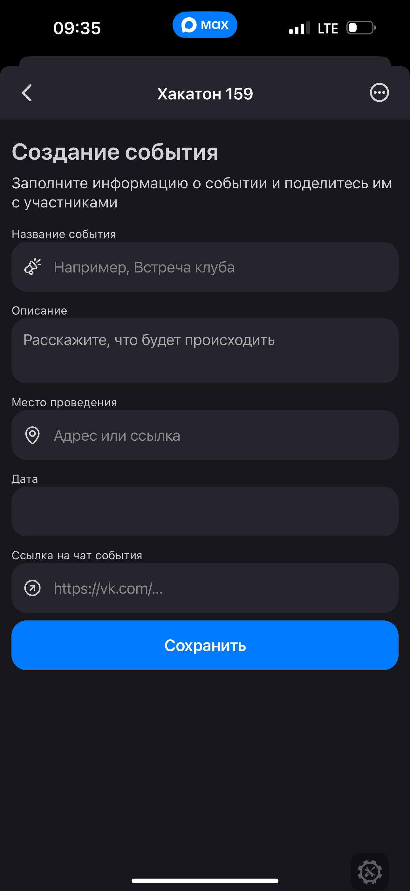
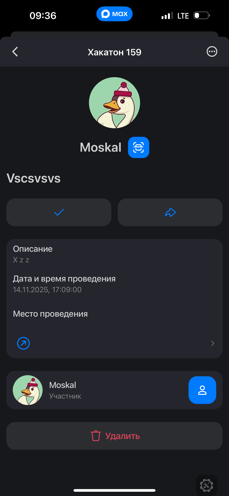

# "Команда с багом" и её мини приложение
### !!!ВНИМАНИЕ!!! 
#### БОТ УЖЕ ЗАПУЩЕН НА СЕРВЕРЕ.

## Инструкция для локального запуска.
### (если очень сильно нужно)

### Действия для остановки бота перед локальным запуском:
Для остановки бота надо отправить POST-запрос на адрес https://platform-api.max.ru/subscriptions с телом "url": "https://d5d91accnt6pb0c1makn.zj2i1qoy.apigw.yandexcloud.net" и заголовком "Authorization: <Токен>"

### Локальный запуск
Команда для создания Docker-образа:
docker build -t max-bot:latest .

Команда для запуска Docker-контейнера:
docker run -e TOKEN='ваш токен бота' -d moskal01/max-bot:latest

## Инструкция по использованию бота:
### 1. Главное экран

### 2. Создание события

### 3. Страница события

### 4. Сканер QR-кодов

